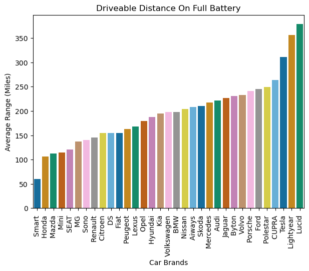

## Can you drive an electric vehicle across the US?

## Overview

The Bipartisan Infrastructure Deal, passed in 2021, made large investments in the US's fight against climate change, commiting to 50% reduction in emissions by 2030 and 100% carbon free emissions by 2035, and a net zero economy by 2050 (White House). A major factor in this radical commitment is the transition from internal combustion engines to electric vehicles, with a 7.5 billion dollar investment in charging infrastructure. More recent legislation has published strict pollution standards for cars, helping the country to "lead the clean vehicle future" (EPA). This mandates that by 2032, ~70% of new car sales will have to be electric vehicles. Today those sales are ~8% (USATODAY).

Despite potential benefits and high regulatory pressure to convert to electric vehicles, there are several factors getting in the way of mass EV adoption, including charging infrastructure and price. The sales of electric vehicles is not on track to meet these targets. Thus, we set out to answer the question: can you drive across the US in an electric vehicle, and what implications does that have for the broader EV industry? We will look at charger availability, vehicle specifications and sales.

## Tools Used
* Python/Pandas/Numpy
* Postgres SQL
* Leaflet
* HTML, CSS, Javascript
* Matplotlib, Seaborn

## Data Sources
* [Alternative Fuels Data Center EV Charging Stations](data/alt_fuel_stations.csv)
* [Alternative Fuels Data Center EV Sales](data/sales_data.csv)
* [Alternative Fuels Data Center EV Station/Charging Port Quantities](data/charger_data.csv)
* [Kaggle EV Info Dataset](data/output.csv)

## Visualizations

Please view our Github Pages site to interact with the leaflet visualization of electric vehicle stations. There is a streetview or topographical option for the base map, and the overlay represents electric vehicle charging stations, with data pulled from this API. https://developer.nrel.gov/docs/transportation/alt-fuel-stations-v1/. 

# EV Charging Station Locations in the US

The marker radius is scaled down to better visualize the locations of electric vehicle stations. When clicking on any particular charging station, the name, address, charging network and hours of operation are displayed. The markers are colored by the amount of chargers available, which can be further explained in the legend. It should be noted that while there are charging stations available in the corridors traveling from coast to coast, they are few in number. This can be a useful tool for planning a long distance trip with an electric vehicle.

# Based on average distance capable on a full battery, you can definitely cross the US in an electric vehicle

This overlay option represents the average range of an electric vehicle centered at each charging station, representing the potential distance capabilities of an EV. There is a high degree of overlap. The average range was calculated by taking the range of more than 100 EV's and finding their mean. While some cars would have greater or less range, this is a good representation of how far an EV can theoretically go. After finding out the average range (~210 miles), the pixels in the leaflet map were converted to meters and then miles. 

# This graph visualizes the growth of charging station and charging ports in the US year over year from 2011 to 2023. 

The rollout of chargers and charging stations is essential for broader adoption of electric vehicles. While the number of chargers and charging stations is growing at a rapid rate, range anxiety and lack of charging infrastructure remain a concern among prospective EV buyers (NYT). 

# This graph shows electric vehicle sales growth from 2011 to 2019. 
While the rate of growth is very high, there seems to be a dip between 2018 and 2019. This could be representative of continued loss of momentum, or incomplete data from that year. While data for sales from 2020 to 2023 was not present in the dataset, a variety of sources say that electric vehicle sales have lost momentum since initial excitement and great growth. 

Using the visualization library, seaborn, graphs were generated to display the average price and range of common electric vehicles on the market. Average prices of electric vehicles are fairly high. With current loan rates exceeding 10% interest and average car prices outpacing increases in salary, the new car is not something that the average American family can afford (Money). When viewing the average battery range of EV's, it is found that the most expensive cars tend to have the best range. 

 Because it is a fairly new technology, the longevity of these costly vehicles is not well understood. However, the lithium batteries powering these cars degrade at a rate of approximately 2.3% per year, meaning over time range will inevitably decrease (KTLA). The shift towards electric vehicles is losing steam, and automakers, including Ford, are favoring hybrid production, as a stepping stone towards broader electrificiation and as a means to meet more stringent federal standards for emissions (CNBC). 

## Data Engineering

## Summary and Instructions
We wanted to integrate the data pulled from online resources into a database so the users viewing this analysis can not only see the possibilities of driving an electric vehicle across the US, but can also effectively make a fact driven decision on which Electric Vehicle they can purchase based on budget and over-all needs.

## ETL Process
The initial phases of the ETL process included the utilization of Pandas to create Dataframes that we could transform before loading it into our SQL Database. Most notably, we snake_cased all of the csv files to avoid errors while loading them into SQL and executed formulas with numpy to convert data from metric to imperial units. 

## Choice of storing data
Provided the given csv files were all structured and could follow ACID requirements, a PostgreSQL database suited best for storage neccessities. Inititialized in pgAdmin 4, the Database named "EV_Database" was created and connected via VS Code. From there, an assortment of tables were created in the schema.sql file including car_data, station_data, ev_sales, and us_ev_stations. Utilizing the copy method, the transformed csv files that underwent an ETL process were successfully imported into our database. This entity relationship diagram shows the relationships and contents of the tables in our database.

## Further manipulation of data
To provide more assurance to users as to how feasible it would be to purchase an electric vehichle to drive across the US, a query was ran to show (from least expensive to most), a table of Brands/Models of EV's and their respective price. Along with other queries demonstrating locations of EV stations and their latitude/longitude, the difference of amounts of EV Stations from the year 2011 to 2023, and purchase trends of EV's in the years 2011, 2015, and 2019.

## Conclusion

While data suggests that you can definitely drive an electric vehicle across the US, and the growth in EV production and sales continue to grow, there are several issues that are getting in the way of federal/global ambitions for electric vehicle adoption. Outside of the US, the coverage of EV chargers could be less reliable, and depending on the vehicle, the continued need to charge would be a hinderance for long distance travel. There are certainly certain regions where an electric vehicle would not be a sensible purchase, such as northern Montana. 

The need to reduce carbon emissions globally is as pertinent as ever, but the transition away from ICE to electrified vehicles will likely take more time than officials anticipate. However, data strongly suggests that the electric vehicle market will continue to grow.

# Sources: 
https://www.whitehouse.gov/briefing-room/statements-releases/2021/11/08/fact-sheet-the-bipartisan-infrastructure-deal-boosts-clean-energy-jobs-strengthens-resilience-and-advances-environmental-justice/

https://www.epa.gov/newsreleases/biden-harris-administration-finalizes-strongest-ever-pollution-standards-cars-position

https://www.usatoday.com/story/opinion/columnist/2024/04/07/biden-electric-vehicle-mandate-epa-rule-climate-change/73189241007/

https://money.com/used-car-costs-unaffordable/#:~:text=Per%20the%20study's%20definition%20of,your%20car%20is%20an%20investment.

https://ktla.com/news/california/why-are-used-ev-prices-cratering-right-now-its-complicated/

https://www.cnbc.com/2024/03/13/ev-euphoria-is-dead-automakers-trumpet-consumer-choice-in-us.html#:~:text=Automakers%20are%20scaling%20back%20or%20delaying%20their%20electric%20vehicle%20plans,-Published%20Wed%2C%20Mar&text=Automakers%20from%20Ford%20Motor%20and,delaying%20their%20electric%20vehicle%20plans. 

https://www.nytimes.com/2023/12/23/us/politics/electric-vehicle-chargers-network.html 
